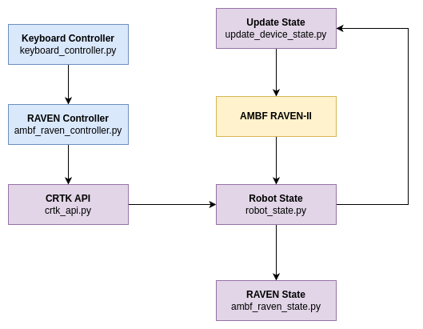

# **RAVEN-II AMBF CRTK Framework**  

A framework for integrating the **AMBF** (Asynchronous Multi-Body Framework) **RAVEN-II** surgical robot with **CRTK API** support to simulate real RAVEN-II behavior with **1000Hz control execution** and publishing the **RAVEN State** topic.

> ⚠ **Note:** Currently, this framework only supports the **left arm** of RAVEN-II (**GOLD arm**).

## **Flowchart**  

  


## **1. Installation & Setup**  

### **Step 1: Setup RAVEN-II Package**

Ensure that you have the **[RAVEN-II Package](https://github.com/uw-biorobotics/raven2)** installed and running on your system.
```bash
mkdir -p ~/raven2_ws/src
cd raven2/src
git clone https://github.com/uw-biorobotics/raven2.git
cd ..
catkin_make

source ~/raven2_ws/devel/setup.bash
```
### **Step 2: Setup AMBF Simulator**  

Ensure that you have the **[AMBF simulator](https://github.com/WPI-AIM/ambf)** installed and running on your system.

### **Step 3: Clone the RAVEN-II AMBF CRTK Framework**  

Open a terminal and run the following command:  

```bash
cd ~
git clone https://github.com/Athenachc/raven2-ambf-crtk.git
```

### **Step 4: Replace the RAVEN-II Model in AMBF**

To ensure the base-link of RAVEN-II is parallel to the ground, replace the RAVEN-II model in the AMBF with the model provided in this repository. For example, if your AMBF model path is:

```bash
~/ambf/ambf_models/meshes/blender_afmb/raven_2
```

Then copy the model files from the repository into that folder:

```bash
cp -r ~/raven2-ambf-crtk/raven_models/* ~/ambf/ambf_models/meshes/blender_afmb/raven_2/
```

### **Step 5: Run AMBF RAVEN-II**

Launch the AMBF simulator with the updated RAVEN-II model by executing:

```bash
~/ambf/bin/lin-x86_64/ambf_simulator -a "/home/sean/ambf/ambf_models/meshes/blender_afmb/raven_2/raven_straight.yaml"
```

If everything is set up correctly, you should see the **AMBF RAVEN-II** running.

### **Step 6: Add an Alias for Convenience (Optional)**

To simplify launching the simulator, add an alias in your `.bashrc` file:

```bash
# Open ~/.bashrc in a text editor
nano ~/.bashrc  

# Add the following alias at the end of the file:
alias ambf-raven2="~/ambf/bin/lin-x86_64/ambf_simulator -a '/home/sean/ambf/ambf_models/meshes/blender_afmb/raven_2/raven_straight.yaml'"

# Save and exit (Ctrl + X, then Y, then Enter)
```

Reload the `.bashrc` file to apply changes:

```bash
source ~/.bashrc
```

Now, you can start **AMBF RAVEN-II** anytime by simply typing:

```bash
ambf-raven2
```

### **Step 7: Run the RAVEN-II AMBF CRTK Framework**

Once AMBF is running, start the **RAVEN-II framework** by executing:

```bash
python3 ~/raven2-ambf-crtk/main.py
```
## Solve "ImportError: dynamic module does not define module export function (PyInit__tf2)"
```
sudo apt update
sudo apt install python3-catkin-pkg-modules python3-rospkg-modules python3-empy

mkdir -p ~/catkin_ws/src; cd ~/catkin_ws
catkin_make
source devel/setup.bash
wstool init
wstool set -y src/geometry2 --git https://github.com/ros/geometry2 -v 0.6.5
wstool up
rosdep install --from-paths src --ignore-src -y -r

catkin_make --cmake-args \
            -DCMAKE_BUILD_TYPE=Release \
            -DPYTHON_EXECUTABLE=/usr/bin/python3 \
            -DPYTHON_INCLUDE_DIR=/usr/include/python3.6m \
            -DPYTHON_LIBRARY=/usr/lib/x86_64-linux-gnu/libpython3.6m.so
# Check the 3 folders: 1) /usr/bin; 2) /usr/include; 3) /usr/lib to see whether the filenames are correct.
# If your files' address are not same as mine, plz replace by your own.

source ~/catkin_ws/devel/setup.bash
```

At this point, the **AMBF RAVEN-II** should be running as if it were a real **RAVEN-II** robot.

## **2. Keyboard Controller**

You can control the **RAVEN-II arm** using a keyboard. Follow these steps:

### **Start AMBF RAVEN-II and the Framework**

First, ensure that AMBF is running:

```bash
ambf-raven2
```

Then, launch the **RAVEN-II AMBF CRTK Framework**:

```bash
python3 ~/raven2-ambf-crtk/main.py
```

### **Run the Keyboard Controller**

Now, start the keyboard control interface:

```bash
python3 ~/raven2-ambf-crtk/keyboard_controller.py
```

### **Notes:**

- The current version **only allows one key input at a time** for stability.
- To modify velocity settings, edit the file:

    ```bash
    ~/raven2-ambf-crtk/keyboard_controller.py
    ```

    At the beginning of this script, you can adjust the **velocity variables** for each joint.

### **📢 Contact**

For any questions or discussions, reach out via **GitHub Issues** or email the maintainers.
